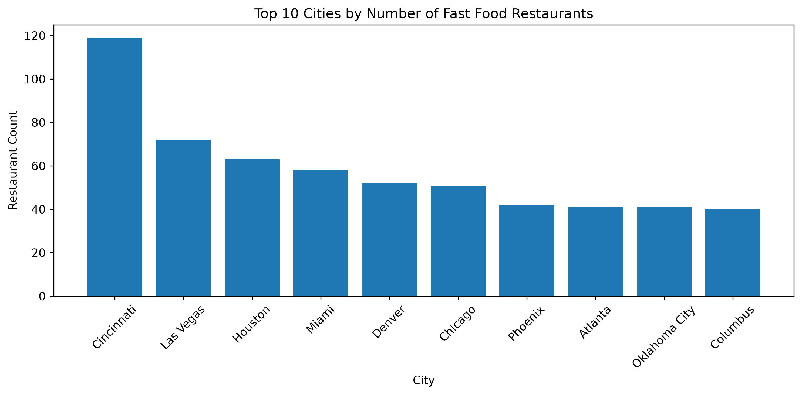

# Fast Food Restaurant Distribution Analysis Across the United States

## Team Members

Aakash Reddy
Parvez
Tarun
Shubham

## Introduction

Fast food restaurants are an important part of the food industry in the United States. Their distribution varies across different cities and states due to differences in population, economic activity, and consumer demand. This project analyzes fast food restaurant locations across the United States and investigates how restaurant availability differs across cities and states using both raw counts and per-capita metrics.

## Problem Statement

The distribution of fast food restaurants is not uniform across the United States. Understanding which cities and states have the highest and lowest concentration of fast food restaurants can provide insights into market presence and accessibility. This project aims to analyze restaurant distribution patterns and identify trends using location and population data.

## Dataset Description

Dataset 1: Fast Food Restaurants Dataset

* Restaurant name
* City
* State
* Latitude
* Longitude

Dataset 2: US Cities Population Dataset

* City
* State
* Population

Dataset 3: US State Population Dataset

* State
* Population

## Data Preparation

The datasets were cleaned and standardized before analysis. State abbreviations were converted into full state names, city names were standardized, and population data was merged with restaurant data. Records with missing population information were removed to ensure accurate per-capita calculations.

## Question 1: Cities with the Most and Least Fast Food Restaurants

### Objective

Identify the cities with the highest and lowest number of fast food restaurant locations.

### Methodology

Restaurant records were grouped by city and the total number of restaurants was calculated for each city.

### Results

Top Cities by Restaurant Count

| City          | Restaurant Count |
| ------------- | ---------------- |
| Cincinnati    | 119              |
| Las Vegas     | 72               |
| Houston       | 63               |
| Miami         | 58               |
| Denver        | 52               |
| Chicago       | 51               |
| Phoenix       | 42               |
| Atlanta       | 41               |
| Oklahoma City | 41               |
| Columbus      | 40               |

### Key Insights

* Cincinnati has the highest number of fast food restaurant locations in the dataset.
* Major metropolitan areas dominate the rankings.
* Fast food restaurants are concentrated in densely populated urban centers.
* Smaller cities generally contain fewer restaurant locations.

### Visualization

