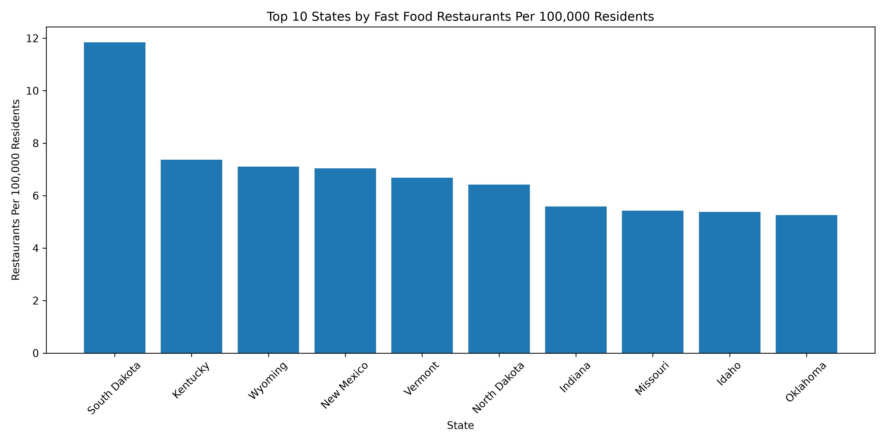
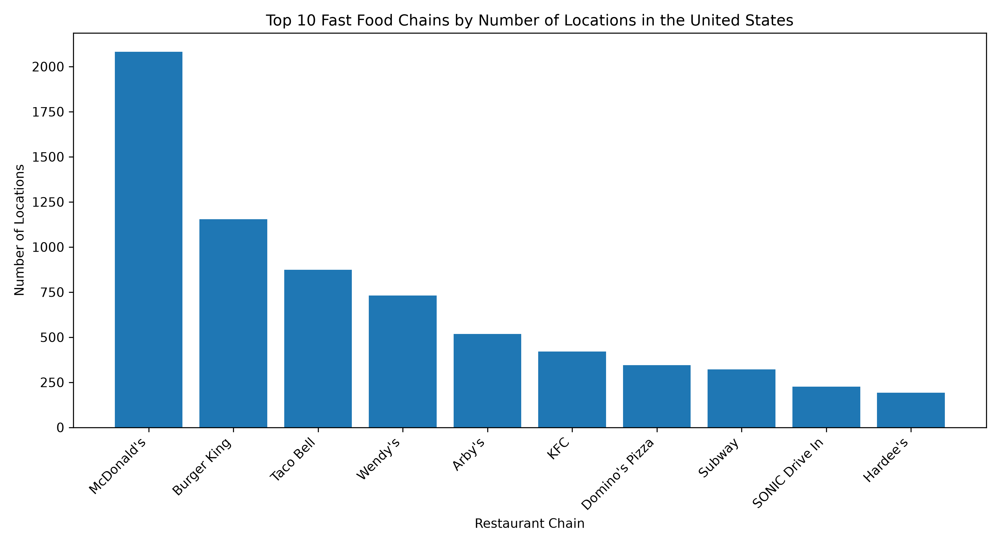
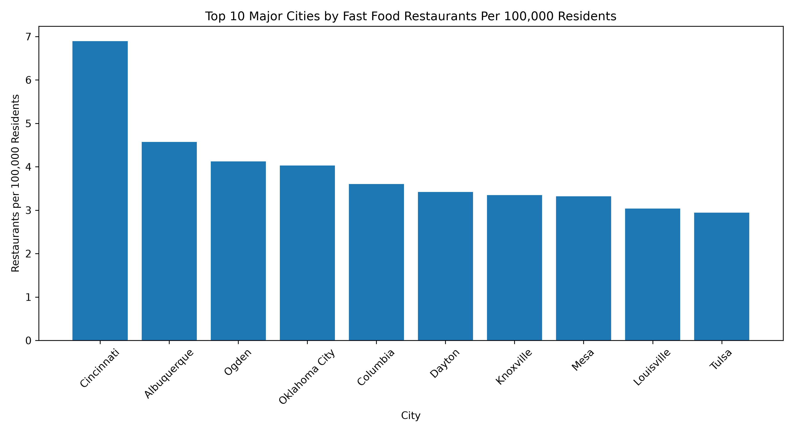

# Fast Food Restaurant Distribution Analysis Across the United States

## Team Members

Aakash Reddy
Parvez
Tarun
Shubham

## Introduction

Fast food restaurants are an important part of the food industry in the United States. Their distribution varies across different cities and states due to differences in population, economic activity, and consumer demand. This project analyzes fast food restaurant locations across the United States and investigates how restaurant availability differs across cities and states using both raw counts and per-capita metrics.

## Problem Statement

The distribution of fast food restaurants is not uniform across the United States. Understanding which cities and states have the highest and lowest concentration of fast food restaurants can provide insights into market presence and accessibility. This project aims to analyze restaurant distribution patterns and identify trends using location and population data.

## Dataset Description

Dataset 1: Fast Food Restaurants Dataset

* Restaurant name
* City
* State
* Latitude
* Longitude

Dataset 2: US Cities Population Dataset

* City
* State
* Population

Dataset 3: US State Population Dataset

* State
* Population

## Data Preparation

The datasets were cleaned and standardized before analysis. State abbreviations were converted into full state names, city names were standardized, and population data was merged with restaurant data. Records with missing population information were removed to ensure accurate per-capita calculations.

## Question 1: Cities with the Most and Least Fast Food Restaurants

### Objective

Identify the cities with the highest and lowest number of fast food restaurant locations.

### Methodology

Restaurant records were grouped by city and the total number of restaurants was calculated for each city.

### Results

Top Cities by Restaurant Count

| City          | Restaurant Count |
| ------------- | ---------------- |
| Cincinnati    | 119              |
| Las Vegas     | 72               |
| Houston       | 63               |
| Miami         | 58               |
| Denver        | 52               |
| Chicago       | 51               |
| Phoenix       | 42               |
| Atlanta       | 41               |
| Oklahoma City | 41               |
| Columbus      | 40               |

### Key Insights

* Cincinnati has the highest number of fast food restaurant locations in the dataset.
* Major metropolitan areas dominate the rankings.
* Fast food restaurants are concentrated in densely populated urban centers.
* Smaller cities generally contain fewer restaurant locations.

### Visualization

## Question 2: Cities with the Most and Least McDonald's per Capita

Objective

The objective of this analysis is to identify which cities have the highest and lowest concentration of McDonald's restaurants relative to their population size.

Methodology

The dataset was filtered to include only McDonald's locations. The number of McDonald's restaurants in each city was counted and divided by the city's population. The result was converted into the number of McDonald's locations per 100,000 residents to allow fair comparisons between cities of different sizes.

Key Findings

Hamilton, Ohio recorded the highest McDonald's concentration with approximately 7.88 locations per 100,000 residents. Williamsburg, Yakima, Pompano Beach, and Rapid City also ranked among the highest.

Large metropolitan areas such as Boston, San Francisco, New York, and Los Angeles showed the lowest McDonald's concentration per capita. Although these cities contain McDonald's locations, their very large populations reduce the number of restaurants per resident.

The results suggest that smaller and medium-sized cities may have a higher concentration of McDonald's locations relative to their population, while major metropolitan areas tend to have lower per-capita values.

# Question 3: Fast Food Restaurants Per Capita for All States

### Objective

The objective of this analysis is to compare the number of fast food restaurants across all U.S. states after taking population into account.

### Methodology

The total number of fast food restaurants was calculated for each state. This information was then combined with state population data to calculate the number of restaurants per 100,000 residents. Using a per-capita measure makes it easier to compare states with very different population sizes.

### Key Findings

South Dakota had the highest number of fast food restaurants per 100,000 residents, followed by Kentucky, Wyoming, New Mexico, and Vermont.

On the other hand, New York, New Jersey, California, Massachusetts, and Alaska had the lowest number of restaurants per 100,000 residents.

### Conclusion

Looking at restaurant counts alone does not provide a complete picture. States with smaller populations may have fewer restaurants overall but still have a higher restaurant concentration per resident. Using a per-capita measure gives a fair comparison between all states.

### Visualization

---

# Question 4: Fast Food Restaurants with the Most Locations Nationally

### Objective

The objective of this analysis is to identify which fast food chains have the largest number of restaurant locations across the United States.

### Methodology

The restaurant names were grouped together and counted. Before calculating the totals, similar restaurant names such as "McDonalds" and "McDonald's" were combined to avoid counting the same restaurant as two different chains.

### Results

| Restaurant Chain | Number of Locations |
| ---------------- | ------------------: |
| McDonald's       |                2082 |
| Burger King      |                1154 |
| Taco Bell        |                 873 |
| Wendy's          |                 731 |
| Arby's           |                 518 |
| KFC              |                 421 |
| Domino's Pizza   |                 345 |
| Subway           |                 322 |
| SONIC Drive In   |                 226 |
| Hardee's         |                 192 |

### Key Findings

McDonald's has the largest number of locations in the dataset by a significant margin. Burger King and Taco Bell also have a strong national presence, followed by Wendy's and Arby's.

The results show that a few major restaurant chains account for a large share of fast food locations across the country.

### Visualization

---

# Question 5: Major Cities with the Most and Least Fast Food Restaurants Per Capita

### Objective

The objective of this analysis is to compare major cities based on the number of fast food restaurants available relative to their population.

### Methodology

Only cities with a population of at least 500,000 were included in this analysis. The total number of restaurants in each city was divided by the city's population and converted into restaurants per 100,000 residents.

### Key Findings

Cincinnati had the highest concentration of fast food restaurants among major cities. Albuquerque, Ogden, Oklahoma City, and Columbia also ranked among the highest.

San Francisco had the lowest concentration, followed by Cape Coral, Mission Viejo, New York, and Concord.

These results show that having a large population does not necessarily mean a city has a higher concentration of fast food restaurants.

### Conclusion

Comparing restaurants on a per-capita basis provides a more meaningful comparison than simply looking at the total number of restaurants. It highlights cities where fast food restaurants are more or less common relative to the number of people living there.

### Visualization

---

# Question 7: States with the Most and Least Fast Food Restaurants Per Capita

### Objective

The objective of this analysis is to identify the states with the highest and lowest concentration of fast food restaurants after adjusting for population.

### Methodology

Restaurant counts for each state were combined with state population data. The number of restaurants per 100,000 residents was then calculated and the states were ranked from highest to lowest.

### Key Findings

South Dakota ranked first with the highest restaurant concentration per capita. Kentucky, Wyoming, New Mexico, and Vermont also had relatively high values.

New York, New Jersey, California, Massachusetts, and Alaska had the lowest restaurant concentration when compared with their populations.

### Conclusion

The analysis shows that population plays an important role when comparing restaurant availability. While larger states often have more restaurants in total, they may have fewer restaurants per resident than smaller states.

### Visualization

